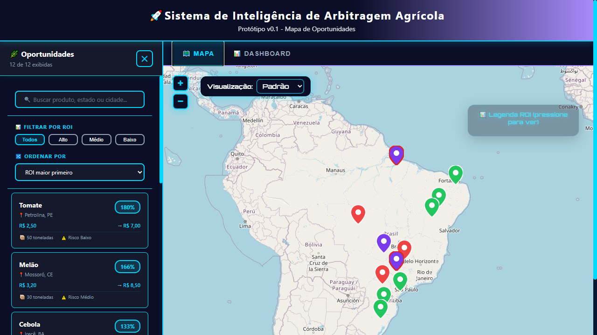
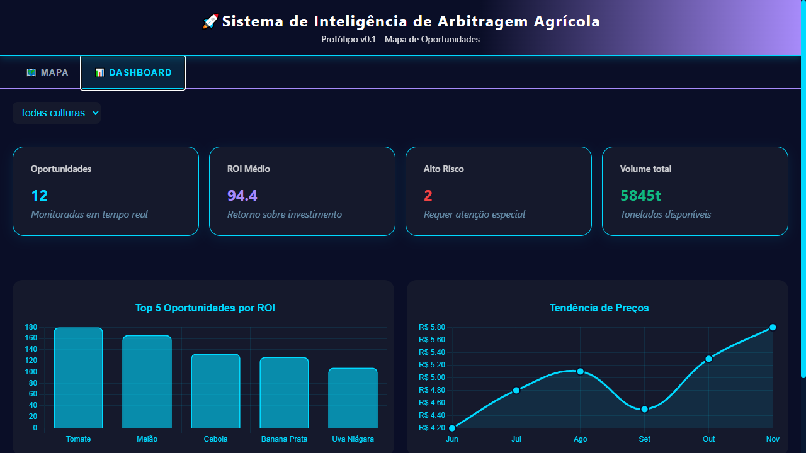
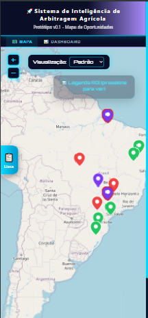

# 🌾 Sistema de Arbitragem Agrícola Inteligente

## 📋 Descrição
Plataforma web de inteligência artificial para identificar oportunidades de arbitragem no mercado agrícola brasileiro, cruzando dados climáticos, preços regionais e volumetria. Prototipado para uso em tomadas de decisão rápidas para produtores e consultores.

## 🗂️ Estrutura do Projeto

agro-ai-prototype/
├── frontend/    # React app: mapa interativo, dashboard, responsividade mobile/desktop
├── backend/     # Node.js API (dados, lógica, endpoints)
├── data/        # GeoJSON IBGE, dados mockados de oportunidades
└── docs/        # Documentação de funcionalidades, padrões e decisões do projeto

## 🛠️ Stack Tecnológico
Frontend: React.js - Leaflet.js - Chart.js - CSS Modules

Backend: Node.js - Express (API REST)

Banco: JSON/SQLite (mock/data real)

Deploy: Vercel (frontend) - Railway (backend)

Design: Figma (protótipos UI/UX)

## 📈 Principais Funcionalidades

Mapa interativo: Visualização geográfica das oportunidades, legendas dinâmicas, filtros por estado/município/produto.

Sidebar Responsiva: Filtros, navegação e seleção adaptados para desktop/tablet/mobile, com botão flutuante para exibição em resoluções menores.

Dashboard: Cards estatísticos, gráficos de tendência/ROI, análise de risco e volume.

Legenda dinâmica: Transparência e destaque interativo, otimizada para mobile.

Header/tabs fixos: Cabeçalho sempre visível, facilitando navegação entre mapa e dashboard.

## ✅ Problemas resolvidos (v0.1)
Legenda do mapa era “invasiva” em mobile: agora transparente, destacada ao toque, sempre visível mas não cobre área útil.

Sidebar inacessível em dispositivos móveis: botão flutuante adicionado, garantindo abertura fácil.

Header/tabs sumiam após interações com o mapa: estrutura reorganizada, header fixo e visível em qualquer contexto.

## 🚦 Testes & Uso
Testes realizados em Chrome DevTools (simulador de dispositivos), desktop e mobile real.

Scroll do dashboard garantido após ajustes de container, margin-top e overflow.

UI testada para responsividade, sobreposição e usabilidade em todos os fluxos principais.

## 📝 Como rodar

bash

### Instalar dependências
cd frontend
npm install

### Rodar app local
npm start
Backend (mock dados):

bash

cd backend
npm install
npm run dev
Acesse http://localhost:3000.

## 💡 Padrões & Diretrizes de Código
Componentização clara com arquivos de estilo separados por página (ex: mapview.css, dashboard.css).

Variáveis globais para cores, espaçamento e breakpoints.

Classes dedicadas para elementos dinâmicos (legend, sidebar, controls).

Utilize sempre media queries para garantir UX ideal em mobile/tablet/desktop.

Documentação de decisões visuais e técnicas disponível em docs/.

## 📸 Screenshots

### Mapa Interativo

### Dashboard Analítico

### Responsividade (Mobile)

## 🙋‍♂️ Desenvolvedor
Gabriel Rodrigues

## 📞 Cliente
Paulo – Sistema IA Agrícola

## 🏁 Timeline
Protótipo: 14/11 - 28/11 (2 semanas)

Versão final: +4 semanas após aprovação

