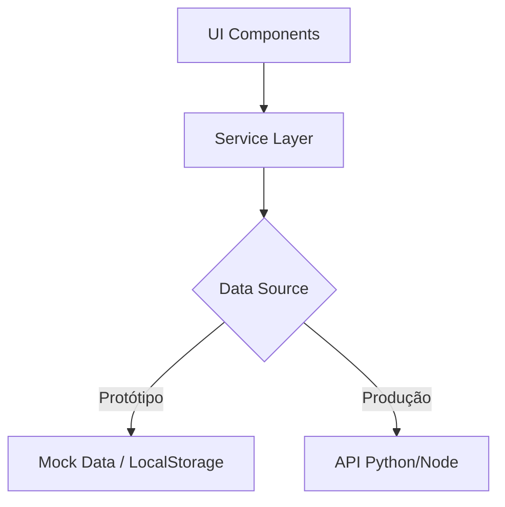

# 🚀 AgroArbitrage AI (Protótipo v0.1)

> **Plataforma de Inteligência Estratégica para Arbitragem Agrícola.**
> Transformando dados climáticos e de mercado em oportunidades de lucro líquido.

   

---

## 📋 Sobre o Projeto

O **AgroArbitrage AI** é uma ferramenta de suporte à decisão (DSS) projetada para identificar janelas de oportunidade de arbitragem no mercado agrícola brasileiro.

O sistema cruza dados de **preço de compra (origem)**, **preço de venda (destino)** e **variáveis logísticas** para calcular o ROI real de operações, mitigando riscos climáticos e de quebra de safra.

### 🎯 Objetivo do Protótipo
Validar a tese de que a visualização geoespacial combinada com simulação financeira reduz o tempo de decisão de dias para minutos.

---

## ✨ Funcionalidades Principais

### 1. 🗺️ Inteligência Geoespacial (Mapa Interativo)
* **Visualização de Clusters:** Marcadores inteligentes que mostram o produto e o ROI instantâneo.
* **Rotas Logísticas Visuais:** Desenho automático do trajeto entre Origem e Destino com cálculo de distância rodoviária.
* **Indicadores Visuais:** Cores semânticas para Risco (🟢 Baixo, 🟡 Médio, 🔴 Alto).
* **Zoom Inteligente:** Ajuste automático de foco ao visualizar uma rota específica.

### 2. 🧮 Simulador de Logística Avançada
Calculadora proprietária que vai além da conta de padaria:
* **Custo de Frete Dinâmico:** Baseado na distância rodoviária (Fator de Sinuosidade 1.35) e preço do diesel.
* **Gestão de Perdas:** Input para taxa de quebra (%) e dias de armazenamento.
* **Persistência:** Capacidade de **Salvar Cenários** para comparação posterior (LocalStorage).

### 3. 📊 Dashboard Executivo
* **KPIs em Tempo Real:** Volume total disponível, ROI médio do portfólio e alertas de risco.
* **Tendência de Preços:** Gráficos históricos para identificar sazonalidade.
* **Gestão de Cenários:** Acesso rápido às simulações salvas anteriormente.

### 4. 📄 Exportação de Relatórios (PDF)
* **Relatórios Executivos:** Geração instantânea de documentos para negociação.
* **Relatório de Dashboard:** Visão geral do mercado para investidores.
* **Relatório de Simulação:** Detalhamento de custos, mapa da operação e projeção de lucro líquido.

### 5. 🔐 Segurança & Acesso
* Sistema de Login simulado.
* Controle de sessão e personalização do ambiente (Header com perfil).

---

## 🛠️ Arquitetura Técnica

Este projeto segue uma arquitetura **Frontend-First** robusta, preparada para escalabilidade:



* **Service Layer Pattern:** Toda a lógica de negócios (cálculo de ROI, busca de dados, persistência, PDF) está isolada em `src/services`. Os componentes visuais (`MapView`, `Dashboard`) apenas renderizam dados. Isso permite plugar um Backend real no futuro sem refazer o Frontend.
* **Layout App-Like:** Utilização de CSS Flexbox avançado para garantir uma experiência de aplicativo nativo (sem conflitos de scroll entre mapa e página).
* **Componentização:** Estrutura modular (`components/Map`, `components/Calculator`, `components/Auth`) facilitando manutenção e testes.

### Stack Tecnológico
* **Core:** React.js (Create React App)
* **Mapas:** React-Leaflet + OpenStreetMap
* **Gráficos:** Chart.js + React-Chartjs-2
* **Relatórios:** jsPDF + AutoTable
* **Estilização:** CSS Modules / Global Styles (Dark Theme)

---

## 🚀 Como Rodar

### Pré-requisitos
* Node.js instalado (v16 ou superior)

### Passo a Passo

1.  **Clone o repositório**
    ```bash
    git clone [https://github.com/seu-usuario/agro-ai-prototype.git](https://github.com/seu-usuario/agro-ai-prototype.git)
    cd agro-ai-prototype/frontend
    ```

2.  **Instale as dependências**
    ```bash
    npm install
    

3.  **Inicie a aplicação**
    ```bash
    npm start

    O sistema abrirá em `http://localhost:3000`.

### 🔑 Credenciais de Acesso (Demo)
Para acessar o protótipo, utilize as credenciais de sócio:
* **E-mail:** `paulo@agro.com`
* **Senha:** `123456`

---

## 📅 Roadmap (Próximos Passos)

* [ ] **Fase 2 (Backend):** Integração com API Python para modelos de IA.
* [ ] **Dados Vivos:** Conexão com APIs da CONAB e INPE (Clima).
* [ ] **Alertas Push:** Notificação via WhatsApp para oportunidades urgentes.

---

Desenvolvido com 💻 e ☕ por **Gabriel Rodrigues**.