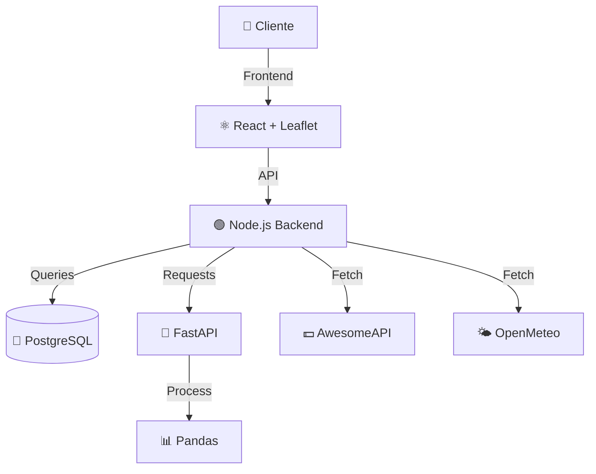

# 🚀 AgroArbitrage AI (MVP v1.0)

**Plataforma de Inteligência Estratégica para Arbitragem Agrícola**

Transformando dados climáticos, financeiros e logísticos em lucro líquido através de IA.

[](https://reactjs.org/)
[](https://nodejs.org/)
[](https://www.python.org/)
[](https://www.postgresql.org/)
[](#)

---

## 📋 Visão Geral

O **AgroArbitrage AI** é um Sistema de Suporte à Decisão (DSS) Full-stack que monitora oportunidades de arbitragem no mercado agrícola brasileiro.

Diferente de planilhas estáticas, o sistema opera em **tempo real**, cruzando:
- 💱 Cotações internacionais (Dólar)
- 🛰️ Previsões meteorológicas (Satélite)
- 🚛 Logística rodoviária

Para calcular o **ROI exato** de cada operação.

---

## 🎯 Diferenciais do MVP

### ✨ Visualização Inteligente
O sistema desenha automaticamente as rotas mais lucrativas (ROI 50%) conectando origem e destino.

### 🌡️ Clima em Tempo Real
Ao clicar em uma região, o sistema consulta satélites e informa a temperatura e chuva no local exato.

### 📊 Clustering Automático
Agrupamento automático de oportunidades para visualização limpa em alta escala.

---

## 🏗️ Arquitetura Técnica

### Arquitetura de Microsserviços
- ✅ Separação clara entre Aplicação Node.js e Inteligência Python
- ✅ Dados vivos com integração de APIs
- ✅ Segurança Enterprise (JWT + Bcrypt)



---

## 📦 Stack Tecnológico

| Camada | Tecnologia | Detalhes |
|--------|-----------|----------|
| **Frontend** | React.js, Leaflet, Chart.js | Responsivo, Visualizações em tempo real |
| **Backend** | Node.js, Express, Prisma ORM | APIs RESTful escaláveis |
| **IA/ML** | Python 3.12, FastAPI | Processamento de dados e algoritmos |
| **Banco de Dados** | PostgreSQL (Supabase/Neon) | Dados estruturados e persistentes |
| **Infraestrutura** | Vercel, Render | Deploy automático, escalabilidade |

---

## 🎁 Funcionalidades Entregues

### 1️⃣ Mapa de Fluxo Comercial (Trade Flow)
**Análise de Armazenagem**
- Algoritmo rodando em Python que analisa a curva de preços futura vs. custos de estocagem
- Localidade: Boca de Jacaré

**Previsão de Risco**
- O sistema recomenda a melhor data de venda baseada em eventos climáticos futuros

### 2️⃣ Cérebro de IA (Python Microservice)
**Custo Real de Logística**
- Cálculo de frete baseado em:
  - Distância rodoviária
  - Fator de Sinuosidade: 1.35
  - Preço do diesel em tempo real

**Multimoeda**
- Conversão automática de valores para Dólar (PTAX) em tempo real

**Persistência**
- Salve cenários de simulação para comparar estratégias posteriormente

### 3️⃣ Simulador Logístico-Financeiro
**Simulações Avançadas**
- Teste múltiplos cenários com um clique
- Análise de sensibilidade para riscos
- Exportação de resultados em tempo real

### 4️⃣ Dashboard & Relatórios
**KPIs Dinâmicos**
- Volume total em movimentação
- ROI médio das operações
- Alertas de Risco atualizados ao vivo

**Exportação PDF**
- Geração de relatórios executivos completos
- Pronto para envio via WhatsApp/Email

---

## 🚀 Como Rodar Localmente

O projeto é composto por **3 partes** que devem rodar **simultaneamente**.

### 📋 Pré-requisitos
```bash
✓ Node.js v18+
✓ Python v3.10+
✓ PostgreSQL (ou usar Supabase)
✓ Git
```

### 1️⃣ Backend Node.js

```bash
cd backend
npm install
```

Crie um arquivo `.env`:
```env
DATABASE_URL=sua_url_postgres_aqui
JWT_SECRET=seu_segredo_jwt_aqui
```

Rodar migrations e seed:
```bash
npx prisma migrate dev --name init
npx prisma db seed  # Popula dados iniciais
```

Iniciar servidor:
```bash
npm run dev
# Rodando em http://localhost:3001
```

### 2️⃣ AI Service (Python)

```bash
cd ai-service
python -m venv venv
```

Ativar virtual environment:
```bash
# Windows
.\venv\Scripts\activate

# Mac/Linux
source venv/bin/activate
```

Instalar dependências:
```bash
pip install -r requirements.txt
```

Rodar servidor:
```bash
uvicorn main:app --reload --port 8000
# Rodando em http://localhost:8000
```

### 3️⃣ Frontend React

```bash
cd frontend
npm install
npm start
# Rodando em http://localhost:3000
```

---

## 🔐 Credenciais de Acesso (Demo)

Para acessar o ambiente de produção ou local:

```
Email: paulo@agro.com
Senha: 123456
```

---

## 🗺️ Roadmap - Próximos Passos (Fase 2)

- [ ] **Machine Learning Avançado**
  - Treinar modelos com histórico de 5 anos da CONAB
  - Previsões com 90%+ de acurácia

- [ ] **PostGIS Integration**
  - Implementar buscas por raio geográfico
  - Exemplo: Fazendas a 50km de um ponto
  - Otimização de rotas com A*

- [ ] **Sistema de Notificações**
  - Alertas via WhatsApp/SMS para oportunidades urgentes
  - Notificações push em tempo real
  - Webhooks customizáveis

- [ ] **Mobile App**
  - Versão React Native para iOS/Android
  - Acesso offline com sincronização

---

## 📚 Documentação

Para documentação completa:
- 📖 [Docs](./docs) - Guias e tutoriais
- 🔌 [API Reference](./docs/API.md) - Endpoints disponíveis
- 🐍 [AI Service Docs](./docs/AI_SERVICE.md) - Modelos e algoritmos

---

## 🤝 Contribuindo

Este é um projeto em desenvolvimento. Sugestões e melhorias são bem-vindas!

```bash
# 1. Fork este repositório
# 2. Crie uma branch para sua feature
git checkout -b feature/MinhaFeature

# 3. Faça commit das mudanças
git commit -m "feat: Adicionei MinhaFeature"

# 4. Push para a branch
git push origin feature/MinhaFeature

# 5. Abra um Pull Request
```

---

## 📄 Licença

Este projeto está sob licença MIT. Veja o arquivo [LICENSE](LICENSE) para mais detalhes.

---

## 👨‍💻 Desenvolvedor

Desenvolvido por **Gabriel Rodrigues**

- 🔗 GitHub: [@Gabriel-Rdrgs](https://github.com/Gabriel-Rdrgs)
- 💼 LinkedIn: [Gabriel Rodrigues](https://linkedin.com/in/gabriel-rodrigues)
- 🌐 Portfolio: [gabriel-dev.com](https://gabriel-dev.com)

---

## 📞 Suporte

Tem dúvidas? Abra uma [Issue](../../issues) ou entre em contato!

---

**⭐ Se este projeto foi útil, deixe uma star!**
